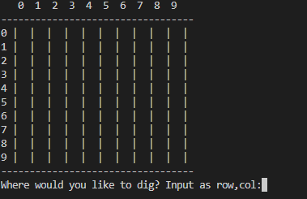
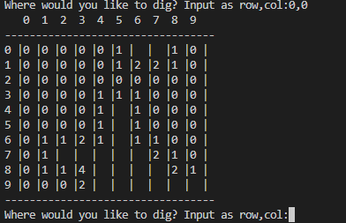
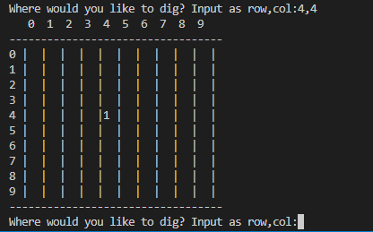
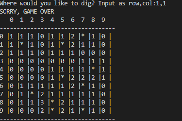

# Minesweeper-in-Python

## About 

This is one of the old and classic games Minesweeper game that we all know.

The game is played by selecting the locasion that you pick by entering the number 
which square you want to dig. You need to dig all spaces and don't dig a mine. 
When you dig the mine the game is over.

## Target Audience

There is no specific audience, this game can be played by all age people. Everyone can play 
this classic game and have fun.

# Features

## Existing  Features

 - Randomly generates the board to play so mines will be on a diffrent place every time user plays
 - Asks user where would it likes to dig
 - lets user to chose row and col. starting from 0 to 9

 

 - user has to chose the location where it wants to dig by entering number 
 between 0 and 9 seperating them by colum
 - when the user submits the location that it want to dig part of the boar 
 will get reveled and the game will ask user to put new location

 

- If the user enters wrong location the game will ask to enter difrent location.
But if user enters the letters instead the numbers the game closes
- At the end user will see message that he won the game if user didn't dig the bomb, 
or it will be loss if user digs the bomb

# Technologies Used

Languages
- Python programming language for the logic of the program
- GitHub was used as a remote repository to store project code
- Git was used for version control within VSCode to push the code to GitHub
- PEP8 was used to check my code against Python conventions
- Heroku Platform was used to deploy the project into live environment

# Validation

- PEP8 Validation Service was used to check the code for PEP8 requirements. All the code passes with no errors and 0 warnings showing

 # Bugs

## Solved Bugs

 - Had an issue with the while loop. The issue was the spelling mistpeled word incorectly
 so loop wasn't working properly.
 - Col line is not lined up properly. Fixed by adding more space to the col line.

 ## Unsolved Bugs

 - When the game asks where the user likes to dig and the user enter not number but a letter 
 the game crashes.

 # Manual Testing

 - When row and col is entered correctlly we dig a hole in there to chech if there is no 
 mine in that location if we do not dig a mine the game cuntinues and asks to enter difrent
 location

 

 - when we dig a mine the game is over and the user gets a message that its Game Over

 

 - User can enter location and put spaces between the number and the game still recognize the location

 
 

